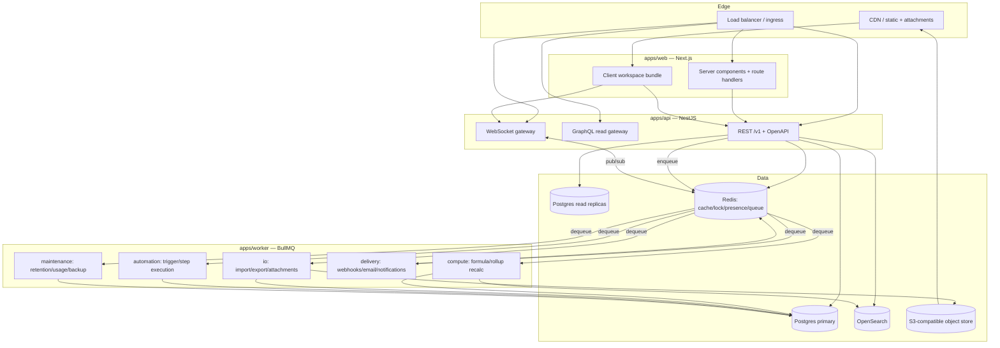

# Tessera — System Architecture

## 1. Topology



## 2. Layering

Every backend module is structured in four strictly-ordered layers. Imports may only point
*downwards*. This is enforced by ESLint `import/no-restricted-paths` and by the module boundary
config in `packages/config/eslint`.

```
┌──────────────────────────────────────────────────────────┐
│ Presentation   controllers, resolvers, gateways, DTOs    │  ← HTTP/WS shape only
├──────────────────────────────────────────────────────────┤
│ Application    services, use-cases, policies, commands   │  ← orchestration + authz
├──────────────────────────────────────────────────────────┤
│ Domain         entities, value objects, domain events    │  ← pure, no I/O, no framework
├──────────────────────────────────────────────────────────┤
│ Infrastructure repositories, adapters, queue, cache, S3  │  ← the only layer that touches I/O
└──────────────────────────────────────────────────────────┘
```

**Rules:**
- Controllers never touch a repository. They call an application service.
- Application services never build SQL. They call a repository interface defined in the domain.
- Domain code has zero imports from `@nestjs/*`, `@prisma/client`, `ioredis`, or `zod`.
- Repositories are the *only* place a tenant scope can be omitted — and they cannot: the base
  repository requires a `TenantContext` in its constructor (see `packages/database`).

## 3. Request lifecycle

```
1.  Ingress            TLS termination, WAF, IP allow/deny
2.  Correlation        x-request-id generated or propagated → AsyncLocalStorage
3.  Rate limit         Redis token bucket, keyed by (tenant, principal, route class)
4.  Authentication     session cookie | bearer PAT | OAuth access token → Principal
5.  Tenant resolution  org/workspace/base id from path or body → TenantContext
6.  Validation         Zod schema parse of params/query/body (fail → 422 with field errors)
7.  Authorization      PolicyEngine.assert(principal, action, resource) (fail → 403 with reason code)
8.  Application        service executes use-case inside a transaction where required
9.  Data access        tenant-scoped repository; RLS active as defence in depth
10. Domain events      collected in the unit of work, flushed after commit
11. Serialization      response DTO built by an explicit mapper (never entity → JSON directly)
12. Observability      metrics, span, structured access log (with secrets redacted)
```

Steps 2–7 are Nest global middleware/guards/interceptors, registered once in
`apps/api/src/bootstrap`. There is no route that can opt out of 4–7 without an explicit,
lint-visible `@Public()` or `@SkipTenantScope()` decorator.

## 4. Event-driven core

Domain changes emit **durable domain events** written in the *same transaction* as the state
change (transactional outbox). A relay process publishes them to Redis Streams; consumers are
idempotent and track their own cursor.

```
Transaction {
  UPDATE records SET ...
  INSERT INTO domain_events (id, tenant_id, type, payload, occurred_at)   ← same tx
}  COMMIT
     ↓
OutboxRelay  →  Redis Stream `events:{org_id}`  →  consumer groups
                                                    ├── search-indexer
                                                    ├── automation-dispatcher
                                                    ├── webhook-dispatcher
                                                    ├── compute-scheduler (formula/rollup)
                                                    ├── notification-fanout
                                                    └── usage-meter
```

**Why an outbox rather than publishing directly:** a direct publish can succeed while the
transaction rolls back (phantom event) or fail after commit (lost event). The outbox makes event
emission exactly as durable as the state change itself.

**Event envelope** (`packages/events`):

```ts
interface DomainEvent<T extends EventType = EventType> {
  id: string;              // ULID — also the idempotency key for consumers
  type: T;                 // 'record.updated'
  version: 1;              // envelope version
  occurredAt: string;      // ISO-8601
  tenant: { organizationId: string; workspaceId?: string; baseId?: string };
  actor: { type: 'user' | 'system' | 'automation' | 'api_token'; id: string | null };
  correlationId: string;   // request id that caused it
  causationId: string | null; // event that caused it, for chains
  payload: EventPayloadMap[T];
}
```

Catalogued event types: `record.created|updated|deleted|restored`, `field.created|updated|deleted`,
`table.*`, `base.*`, `view.*`, `comment.created`, `member.invited|joined|removed`,
`permission.changed`, `automation.triggered|completed|failed`, `form.submitted`,
`attachment.uploaded|processed`, `subscription.changed`, `usage.threshold_crossed`.

## 5. Real-time

- Client opens **one** WebSocket per browser tab, multiplexing channel subscriptions.
- Channels: `base:{id}` (presence, schema), `view:{id}` (row deltas for the active query),
  `record:{id}` (expanded record), `user:{id}` (notifications).
- The gateway is **stateless**; presence and channel membership live in Redis with TTL heartbeats,
  so any node can serve any client and nodes scale horizontally behind a sticky-free LB.
- Fan-out uses Redis pub/sub keyed by channel; each gateway node forwards only to locally
  connected sockets subscribed to that channel.
- Deltas are **field-level patches**, never whole records: `{recordId, version, changed: {fieldId: value}}`.
- Falls back to Server-Sent Events + polling when WebSocket upgrade fails (corporate proxies).

Full design: [`06-realtime-collaboration.md`](./06-realtime-collaboration.md).

## 6. Caching strategy

| Layer | Contents | Key shape | Invalidation |
|---|---|---|---|
| CDN | JS/CSS, public form assets, attachment thumbnails | content-hashed URL | immutable |
| Redis: schema | table + field definitions, view configs | `t:{org}:schema:{baseId}:v{schemaVersion}` | version bump on DDL |
| Redis: query | view page results | `t:{org}:view:{viewId}:{queryHash}:{tableVersion}` | table version bump on any write |
| Redis: authz | resolved permission set per (principal, resource) | `t:{org}:authz:{userId}:{resourceId}` | TTL 60 s + explicit bust on membership/permission change |
| Redis: compute | formula results for expensive nodes | `t:{org}:calc:{fieldId}:{recordId}:{depsHash}` | dependency hash change |
| In-process | field type registry, formula function table | n/a | process lifetime |

**Every cache key is prefixed with `t:{organizationId}`.** A cache-key builder in
`packages/database/src/cache` is the only sanctioned way to construct keys, and it takes the
`TenantContext` as its first argument — a scoped key cannot be forgotten.

## 7. Idempotency

| Surface | Mechanism |
|---|---|
| Public API writes | `Idempotency-Key` header → Redis `SETNX` for 24 h storing the response; replay returns the stored response with `Idempotent-Replay: true` |
| Queue jobs | Job id derived deterministically from `(eventId, consumerName)`; BullMQ dedupes |
| Automation runs | `(automationVersionId, triggerEventId)` unique index on `automation_runs` |
| Webhook deliveries | `event_id` sent in header and body; receivers dedupe; we retry with the same id |
| Stripe webhooks | `stripe_event_id` unique index; handler is a no-op on conflict |

## 8. Failure isolation

| Dependency | Failure mode | Degradation |
|---|---|---|
| OpenSearch | down | Search falls back to Postgres trigram search on the current table only; global search returns 503 with a clear message |
| Redis cache | down | Cache-aside falls through to Postgres; latency rises, correctness unaffected |
| Redis queue | down | Writes still succeed; outbox accumulates; relay drains on recovery. Automations lag, they do not fail |
| Object storage | down | Attachment upload/download fails with a retryable error; the rest of the app works |
| Read replica | lagging | Reads that require read-your-writes are pinned to primary via a per-request `needsPrimary` flag set after any write in the same session |
| Stripe | down | Billing UI degrades; entitlements are served from the cached local `subscriptions` row |

Circuit breakers wrap OpenSearch, Stripe, and all outbound integration calls
(`packages/events/src/circuit-breaker.ts`). No outbound call is made without a timeout.

## 9. Cross-cutting decisions

| # | Decision | Rationale |
|---|---|---|
| A1 | NestJS for the API rather than route handlers in Next.js | DI, module boundaries, guards/interceptors, and a first-class WebSocket gateway. Route handlers do not scale to 25 domains without becoming a swamp |
| A2 | Next.js App Router for web, but the workspace shell is client-side | RSC is excellent for marketing/settings/read pages; the grid is a stateful, keyboard-driven, virtualised surface that belongs in a client component with local state |
| A3 | Prisma as the ORM, with raw SQL for the query builder | Prisma gives type-safe CRUD and migrations; the dynamic filter/sort/group query builder must emit tuned SQL that no ORM DSL expresses well. Both are wrapped by repositories |
| A4 | Separate `apps/worker` process, not in-API workers | Independent scaling and blast radius; an automation storm must not consume API request capacity |
| A5 | ULIDs for all primary keys | Sortable by creation time (good index locality, unlike UUIDv4), opaque, generatable client-side for optimistic inserts |
| A6 | Zod schemas in `packages/validation`, shared by API and web | One definition validates the request, types the client SDK, and drives the form |
| A7 | No provider-specific SDK outside an adapter | S3, email, and payments are behind interfaces in `packages/*/ports`, so the platform is not welded to one cloud |
