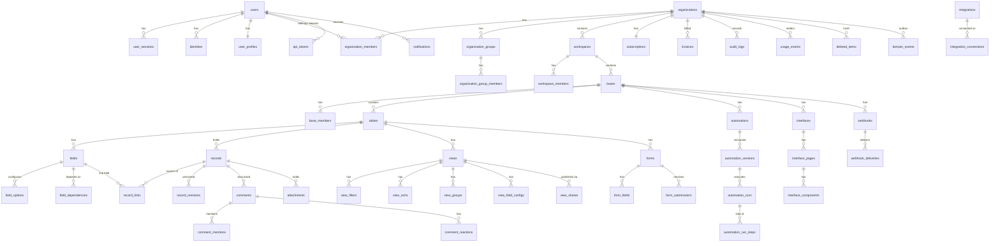

# Tessera — Database Design

PostgreSQL 16. Prisma for schema/migrations/typed CRUD; hand-written SQL behind repositories for
the dynamic query builder.

---

## 1. The central decision: how to store record values

This is the decision the entire product's performance rests on. Five candidate models were
evaluated against the real workload: **flexible user-defined schemas, filter/sort/group pushdown
on arbitrary fields, 1M+ rows per table, sub-second view queries, and safe schema change.**

### 1.1 Option A — Normalised value table (EAV)

```sql
record_values(record_id, field_id, text_value, number_value, date_value, json_value)
```

| | |
|---|---|
| ✅ | Fully flexible; adding a field is a row insert; sparse data costs nothing |
| ✅ | Per-type columns allow typed indexes |
| ❌ | **Reading one record with 40 fields = 40 rows.** A 100-row page = 4,000 rows to fetch and pivot |
| ❌ | Filtering on 3 fields requires 3 self-joins; the planner degrades badly past ~2 joins on a large table |
| ❌ | Sorting on a field not in the filter set requires an additional join + sort of the full match set |
| ❌ | Row count = records × fields. 1M records × 40 fields = 40M rows *per table* |

**Verdict: rejected as the primary model.** It is correct and flexible and it does not survive
the query shapes we need.

### 1.2 Option B — Pure JSONB document

```sql
records(id, table_id, data jsonb)   -- data = { "fld_x": "value", "fld_y": 42 }
```

| | |
|---|---|
| ✅ | One row per record. Reading a page is a plain seq/index scan — fastest possible read path |
| ✅ | Adding, renaming, removing a field is metadata-only. No DDL, no table rewrite, no lock |
| ✅ | GIN index supports containment (`@>`) and existence queries well |
| ❌ | **Ordering is the killer.** `ORDER BY data->>'fld_x'` cannot use a GIN index. It needs a btree expression index *per field*, which is DDL again — and Postgres caps practical index count per table |
| ❌ | `data->>'x'` is text; numeric and date ordering require a cast, and the planner's selectivity estimates on expressions are poor |
| ❌ | Whole-row rewrite on every single-cell update; TOAST churn on wide records |

**Verdict: rejected alone.** Excellent reads, unacceptable sorts.

### 1.3 Option C — Dynamically generated physical tables (one real table per user table)

| | |
|---|---|
| ✅ | Native types, native indexes, native planner statistics — the fastest possible everything |
| ❌ | Every field add/change is `ALTER TABLE` — an `ACCESS EXCLUSIVE` lock. At scale this is an outage generator |
| ❌ | **Catalog explosion.** 100k tenants × 20 tables = 2M relations. `pg_class` bloat destroys planning time and `pg_dump` |
| ❌ | Migrations become per-tenant programs. Rollback is effectively impossible |
| ❌ | Connection pooling and prepared-statement caching collapse under unbounded relation count |

**Verdict: rejected.** This is what a single-tenant on-prem product does. It does not multi-tenant.

### 1.4 Option D — Columnar analytics store as primary

| | |
|---|---|
| ✅ | Superb aggregation and scan throughput |
| ❌ | Single-row update latency is orders of magnitude worse than a heap table. Our workload is *interactive single-cell edits* |
| ❌ | No practical transactional integrity with the relational metadata |

**Verdict: rejected as primary; retained as an optional Phase 9 analytics mirror.**

### 1.5 Option E — **Hybrid: JSONB payload + promoted typed columns  ← SELECTED**

```sql
CREATE TABLE records (
  id             CHAR(26)      PRIMARY KEY,        -- ULID
  table_id       CHAR(26)      NOT NULL,
  organization_id CHAR(26)     NOT NULL,           -- denormalised tenant key, for RLS + index prefix
  data           JSONB         NOT NULL DEFAULT '{}',
  -- promoted slots: generic, reusable, typed
  s0 TEXT, s1 TEXT, s2 TEXT, s3 TEXT,              -- string slots
  n0 NUMERIC, n1 NUMERIC, n2 NUMERIC, n3 NUMERIC,  -- numeric slots
  d0 TIMESTAMPTZ, d1 TIMESTAMPTZ, d2 TIMESTAMPTZ,  -- temporal slots
  b0 BOOLEAN, b1 BOOLEAN,                          -- boolean slots
  version        INTEGER       NOT NULL DEFAULT 1, -- optimistic concurrency
  auto_number    BIGINT        NOT NULL,
  created_at     TIMESTAMPTZ   NOT NULL DEFAULT now(),
  created_by     CHAR(26),
  updated_at     TIMESTAMPTZ   NOT NULL DEFAULT now(),
  updated_by     CHAR(26),
  deleted_at     TIMESTAMPTZ                       -- soft delete → trash
);
```

**How promotion works.** Each `fields` row optionally carries `promoted_slot` (e.g. `'n1'`). When
a field is used in a view filter, sort, or group — or is marked as such by the user — a background
job assigns it a free slot of the matching physical type, backfills the column from `data` in
batches, creates a **partial, tenant-prefixed btree index**, and flips the field to promoted. The
query builder reads `promoted_slot` from the field metadata and emits `ORDER BY r.n1` instead of
`ORDER BY (r.data->>'fld_x')::numeric`.

Promotion is **online**: the JSONB value remains the source of truth during backfill, writes
update both, and the planner only sees the column after the index is `VALID`.

```sql
-- one index per slot, per table, tenant-prefixed for locality and isolation
CREATE INDEX CONCURRENTLY idx_records_t_n1
  ON records (organization_id, table_id, n1)
  WHERE deleted_at IS NULL;

-- default access path
CREATE INDEX idx_records_table_seq
  ON records (organization_id, table_id, id) WHERE deleted_at IS NULL;

-- containment / arbitrary unpromoted predicates
CREATE INDEX idx_records_data_gin
  ON records USING gin (data jsonb_path_ops) WHERE deleted_at IS NULL;

-- full-text within a table
CREATE INDEX idx_records_fts
  ON records USING gin (to_tsvector('simple', jsonb_to_text(data)));
```

**Why this is the right trade-off:**

| Requirement | How the hybrid satisfies it |
|---|---|
| Flexible schema | New fields land in `data` immediately. Zero DDL, zero lock, instant |
| Efficient filter | Promoted fields use btree; unpromoted use GIN containment; both push down to SQL |
| Efficient sort | Promoted fields sort on a real typed column with real statistics — the JSONB weakness is eliminated exactly where it hurts |
| Bounded index count | Fixed slot count (13 slots) per table shape → a bounded, predictable index set. No catalog explosion |
| Safe schema change | Field ops are metadata + async backfill, never blocking DDL |
| Large scale | `records` is `PARTITION BY HASH (organization_id)` (32 partitions), so each tenant's data clusters and vacuum/index maintenance is parallel |
| Relations | Links live in a dedicated `record_links` table (§3), not in JSONB — so joins are indexed and bidirectional |

**Cost accepted:** a single-cell update rewrites the row (JSONB + any promoted slot). Mitigated by
`fillfactor = 80` on `records` to keep HOT updates on-page, and by batching multi-cell edits into
one statement.

**Slot exhaustion policy:** if a table needs more sortable fields than the slot budget, the 14th+
promotion request is refused with a clear product-level message and the field falls back to
expression-index-free JSONB ordering. Telemetry tracks how often this fires; if it is common,
the slot budget is widened in a migration (it is a plain `ALTER TABLE ADD COLUMN` with defaults,
which is metadata-only in PG 11+).

---

## 2. Entity–relationship diagram



## 3. Relationship storage

Links are **never** stored in `data`. They live in an explicit edge table so both directions are
indexed and cascade policies are enforceable.

```sql
CREATE TABLE record_links (
  id                CHAR(26) PRIMARY KEY,
  organization_id   CHAR(26) NOT NULL,
  field_id          CHAR(26) NOT NULL,   -- the link field on the source side
  source_record_id  CHAR(26) NOT NULL,
  target_record_id  CHAR(26) NOT NULL,
  position          INTEGER  NOT NULL DEFAULT 0,   -- user-ordered links
  created_at        TIMESTAMPTZ NOT NULL DEFAULT now(),
  UNIQUE (field_id, source_record_id, target_record_id)
);
CREATE INDEX ON record_links (organization_id, field_id, source_record_id);
CREATE INDEX ON record_links (organization_id, field_id, target_record_id);  -- reverse traversal
```

- **1:1** — unique constraint on both `source_record_id` and `target_record_id` per field.
- **1:N** — unique on `target_record_id` per field pair.
- **N:M** — no additional uniqueness.
- **Self-referencing** — `source` and `target` in the same table; a cycle check runs for
  hierarchy-typed links (`parent`/`children`).
- **Bidirectionality** — a link field stores `symmetric_field_id`; creating a link writes one edge
  row and both sides read it (source direction for the owner, target direction for the symmetric
  field). No duplicated rows, no drift.
- **Delete policy** — `on_delete` on the field: `unlink` (default), `restrict`, `cascade`.
  Enforced in the application layer inside the delete transaction *and* by a deferred trigger for
  `restrict`.

## 4. Computed-field dependency graph

```sql
CREATE TABLE field_dependencies (
  organization_id CHAR(26) NOT NULL,
  dependent_field_id CHAR(26) NOT NULL,   -- the formula/lookup/rollup
  source_field_id    CHAR(26) NOT NULL,   -- what it reads
  via_link_field_id  CHAR(26),            -- non-null for lookup/rollup across a link
  PRIMARY KEY (dependent_field_id, source_field_id, via_link_field_id)
);
```

The graph is loaded per base and kept in Redis (`t:{org}:depgraph:{baseId}`). On any write, the
affected dependent set is computed by BFS over this table, deduped, topologically sorted, and
enqueued. Cycles are rejected **at field save time** by running Tarjan's SCC over the prospective
graph — a formula that would create a cycle never persists.

## 5. Tenant isolation in the schema

1. **Every** tenant-owned table carries `organization_id` as a real column, denormalised from its
   parent. It is the first column of nearly every index.
2. **Row-level security** is enabled on all tenant tables as defence in depth:

```sql
ALTER TABLE records ENABLE ROW LEVEL SECURITY;
ALTER TABLE records FORCE ROW LEVEL SECURITY;
CREATE POLICY tenant_isolation ON records
  USING (organization_id = current_setting('app.current_org', true));
```

The application sets `app.current_org` per transaction from `TenantContext`. Application-layer
scoping is the primary control; RLS is the backstop that turns a forgotten `WHERE` from a breach
into an empty result set.

3. **Foreign keys are composite** where they cross a tenant boundary risk, e.g.
   `FOREIGN KEY (organization_id, table_id) REFERENCES tables (organization_id, id)` — making a
   cross-tenant reference structurally impossible, not merely unlikely.

## 6. Partitioning and growth

| Table | Strategy | Rationale |
|---|---|---|
| `records` | `HASH (organization_id)` × 32 | Tenant locality; parallel vacuum; bounded per-partition index size |
| `record_revisions` | `RANGE (created_at)` monthly | Retention is a partition drop, not a mass delete |
| `audit_logs` | `RANGE (created_at)` monthly | Same; also enables cheap cold-storage export |
| `automation_runs` | `RANGE (created_at)` monthly | Same |
| `webhook_deliveries` | `RANGE (created_at)` weekly | High volume, short retention |
| `usage_events` | `RANGE (created_at)` daily | Aggregated nightly, then dropped |
| `domain_events` | `RANGE (occurred_at)` daily | Outbox; dropped after relay confirms |

## 7. Concurrency control

- `records.version` is incremented on every write. Update statements carry
  `WHERE id = $1 AND version = $2`; zero rows affected → `RECORD_VERSION_CONFLICT` (409).
- Clients may send `If-Match: <version>`. Omitting it opts into last-write-wins **per field**
  (the update statement uses `jsonb_set` on only the changed keys, so two users editing two
  different fields of the same row never conflict).
- Schema changes take a Redis advisory lock `t:{org}:lock:schema:{baseId}` for the duration, so
  two concurrent field migrations on one base serialise.

## 8. Indexing policy

Every index is justified by a named query. The rules:
- Tenant column first, always.
- Partial `WHERE deleted_at IS NULL` on soft-deleted tables — the trash is a small minority.
- No index is added without an `EXPLAIN (ANALYZE, BUFFERS)` in the PR description.
- `pg_stat_statements` and `pg_stat_user_indexes` are reviewed monthly; unused indexes are dropped.

## 9. Migration safety rules

1. No blocking DDL in the deploy path. `CREATE INDEX CONCURRENTLY`, `ADD COLUMN` with no volatile
   default, `NOT NULL` via `CHECK NOT VALID` → `VALIDATE CONSTRAINT`.
2. Expand → migrate → contract, always across three deploys. Never drop a column in the same
   release that stops writing it.
3. Every migration has a tested down path or an explicit, reviewed `-- IRREVERSIBLE` marker.
4. `lock_timeout = 3s` and `statement_timeout = 30s` are set for migration sessions; a migration
   that cannot get its lock fails fast instead of queueing behind a long read and stalling writes.
