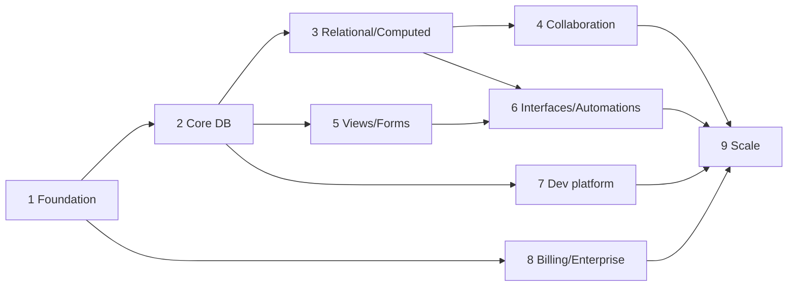

# Tessera — Phased Implementation Roadmap

Each phase leaves the application **runnable, deployable, and green in CI**. A phase is not done
until frontend, backend, data layer, permissions, validation, error states, loading states, tests,
and documentation all exist for its features.

---

## Phase 1 — Architecture & Foundation

**Objectives:** a real multi-tenant skeleton that a user can register into, create an organization
and workspace in, invite someone to, and log out of — with authorization enforced server-side and
the design system in place.

| Area | Deliverable |
|---|---|
| Monorepo | npm workspaces + Turborepo, strict TS, ESLint (incl. custom layering + tenant-scope rules), Prettier, husky + commitlint |
| Packages | `config` (env validation), `types`, `validation` (Zod), `logger` (redacting), `events` (envelope, outbox, job dispatcher), `permissions` (policy engine), `database` (Prisma schema, tenant-scoped repositories, migrations, RLS), `auth`, `ui` (design system), `sdk`, `testing` |
| API | Bootstrap pipeline (correlation → rate limit → auth → tenant → validation → policy → error filter), auth module (register, verify, login, logout, refresh, magic link, password reset/change, TOTP 2FA + recovery codes, sessions list/revoke, Google/Microsoft OAuth), users, organizations, members, invitations, groups, workspaces, audit log write path, OpenAPI generation |
| Web | App Router shell, design tokens + primitives, light/dark/system, auth pages, org/workspace management, member management, settings, command palette shell, error/loading/empty states |
| Worker | Job runtime with tenant context, handlers for `email.send`, `session.prune`, `usage.aggregate` |
| Infra | docker-compose (PG, Redis, MinIO, OpenSearch, Mailpit), Dockerfiles, `.env.example`, seed |
| Tests | Unit (policy engine, validation), integration (every auth + org + workspace route), **tenant isolation suite**, **permission matrix suite**, E2E flows 1–2, axe on all auth/settings pages |
| Docs | This document set + `README`, `CONTRIBUTING`, `SECURITY.md`, setup guide |

**Exit criteria:** two organizations exist, a member of one cannot touch the other through any
route, CI is green, `docker compose up && npm run dev` works from a clean clone.

---

## Phase 2 — Core Database Experience

Bases · tables · fields (non-computed subset) · records · grid view · filter/sort/group ·
import/export · expanded record.

- Field-type registry with the conformance suite; 28 non-computed types.
- The dynamic query builder (filter IR → parameterised SQL) with cursor pagination.
- Virtualised grid: inline edit, keyboard navigation, multi-select, clipboard paste of ranges,
  fill handle, undo/redo, column resize/reorder/freeze, row height, context menus, summaries.
- Field promotion background job.
- Async CSV/TSV/XLSX/JSON import with mapping, preview, dedupe, error report; export.
- Expanded record panel with attachments and activity.

**Exit:** a 1M-row table browses at p95 < 400 ms; E2E flows 3, 4, 8, 14, 15.

---

## Phase 3 — Relational & Computed

Linked records (all cardinalities, symmetric fields, delete policies) · lookup · rollup · count ·
formula engine · dependency graph · recalculation workers · revision history · trash & restore.

**Exit:** E2E flows 5, 6, 7; formula unit suite ≥ 95% coverage; `formula-cascade` load scenario
passes.

---

## Phase 4 — Collaboration

WebSocket gateway · presence · live deltas · conflict handling · comments (rich text, mentions,
reactions, replies, resolution) · notifications (in-app, email, preferences) · activity history ·
share links.

**Exit:** E2E flows 10, 11; `realtime-fanout` scenario passes; zero lost writes in
`cell-edit-storm`.

---

## Phase 5 — Advanced Views & Forms

Kanban · calendar · gallery · list · timeline · gantt · chart · map · dashboard · form builder ·
public/authenticated forms with conditional logic, validation, and submission metadata.

**Exit:** E2E flow 9; every view type has its own permission and share behaviour tested.

---

## Phase 6 — Interfaces & Automations

Interface builder (pages, components, bindings, actions, responsive preview, publishing) ·
automation builder (trigger/condition/action DAG, branching, delays, versioning, test mode) ·
execution engine, logs, retries, DLQ · webhook triggers · external actions.

**Exit:** E2E flow 12; `automation-burst` scenario passes with zero duplicate executions.

---

## Phase 7 — Developer Platform & Integrations

Public REST API hardening · PATs · OAuth apps · scoped keys · rate limits and usage analytics ·
outbound webhooks with signing, retries, replay, health · generated TypeScript SDK · OpenAPI docs
site · Slack, Google Drive, Gmail, Google Calendar, Microsoft 365, Zapier/Make.

**Exit:** E2E flows 18, 19; SDK published from CI; integration credential encryption verified.

---

## Phase 8 — Billing & Enterprise

Stripe subscriptions (plans, trials, coupons, tax, proration, seats, dunning) · usage metering and
enforcement · invoices · SSO foundations (SAML/OIDC) · SCIM · enforced 2FA · audit export ·
platform admin console with audited impersonation · feature flags · custom roles.

**Exit:** E2E flows 16, 17; billing webhook idempotency tests; entitlement enforcement tested at
every metered boundary.

---

## Phase 9 — Scale & Hardening

Load testing at target volumes · security testing (pentest + ZAP + SAST triage) · performance
optimisation from real profiles · OpenSearch scale-out · read replicas and the shard router
switched on · DR drill · full observability dashboards and alerts · SOC 2 evidence collection.

**Exit:** all load scenarios pass at target; no High+ findings open; DR drill meets RPO/RTO.

---

## Dependency graph between phases

Phases 5 and 7 can run in parallel with 3/4 given separate people; everything else is sequential.
